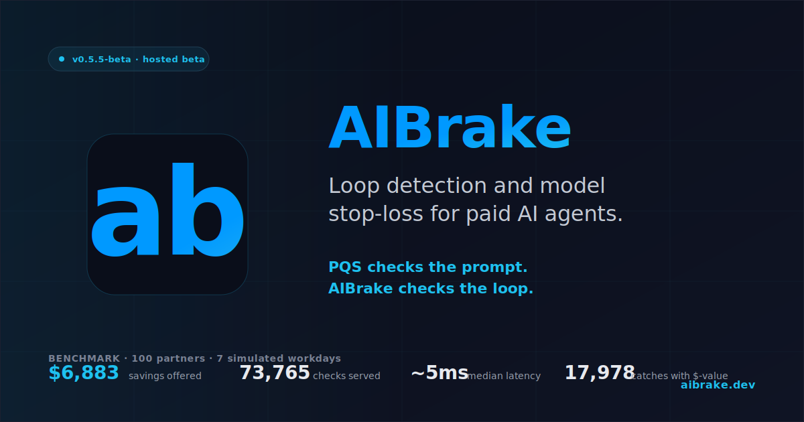

# AIBrake

<p align="center">
  
</p>

> **Loop detection and model stop-loss for paid AI agents.**
>
> **PQS checks the prompt. AIBrake checks the loop.**

> **Status:** Stage 0.5.5 — First public npm release as `aibrake`
> **Version:** `0.5.5-beta`
> **Base:** `spending-guard-v0.5.4-beta`
> **Tag:** `aibrake-v0.5.5-beta`
> **Primary value:** loop detection + model stop-loss + **$-denominated projected savings** on every catch, **with a live public counter**
> **Mode:** hosted beta / shadow-first
> **Tests:** 198 TS unit + 14 audit + 36 harness actions; **35 Python tests passing** on Python 3.14
> **Latest:** package renamed `spending-guard` → `aibrake` on npm (the historical name was never published; we took the brand-matching name directly). The hosted API stays at `api.aibrake.dev`; env vars / API key prefix / class names preserved for backwards compat.
> **SDKs:** TypeScript ([`aibrake`](https://www.npmjs.com/package/aibrake)) + Python (`python/agent_spend_guard`)
> **Next step:** real partner integration → 7 days of logs → useful-warning review → pricing/x402 decision (see [`INTEGRATION_GUIDE.md`](./INTEGRATION_GUIDE.md), [`PARTNER_ONBOARDING.md`](./PARTNER_ONBOARDING.md), [`PYTHON_SDK.md`](./PYTHON_SDK.md), [`CODING_AGENT_ADAPTER.md`](./CODING_AGENT_ADAPTER.md), [`DEPLOYMENT.md`](./DEPLOYMENT.md))
> **npm package name:** `aibrake` (the SDK class name `SpendingGuard` is preserved for backwards compat — see [`IMPLEMENTATION_NOTES.md § 13`](./IMPLEMENTATION_NOTES.md))

AIBrake is a provider-agnostic, x402-ready pre-flight judgment middleware for expensive AI agent actions. It checks paid LLM calls, tool retries, model escalations and objective drift **before** execution and tells the operator whether to allow, warn, ask for confirmation, downgrade, delay or block.

This is **not** a budget counter. The product value is judgment:

- Is the agent retrying the same deterministic failure without new evidence?
- Is it escalating to a more expensive model without learning anything new?
- Is it drifting away from the original objective?
- Is another paid call likely to produce real progress, or is it just the 7th guess?

**Don't pay for the 7th guess.**

---

## Install

```bash
npm install aibrake
```

`<1 MB` install. No fastify, no transitive web-framework deps.

### Plug into an agentic IDE (Claude Code / OpenClaw / Cursor / Cline) — 4 lines

Add to your MCP config (`~/.claude/settings.json`, `mcp-config.json`, or your runtime's equivalent):

```jsonc
{
  "mcpServers": {
    "aibrake": { "command": "npx", "args": ["-y", "aibrake@beta", "mcp"] }
  }
}
```

Restart the agent. AIBrake now appears as an `aibrake_check` tool the agent can — and per its own description, **must** — call before any retry, deploy, install, or success-assertion. Returns `allow / warn / require_confirmation / block` with a reason and projected savings.

### One-line integration for Node.js apps with openai / anthropic

If you own a Node.js process that calls `openai` or `@anthropic-ai/sdk` directly, add ONE line at the top of your entrypoint:

```ts
import "aibrake/auto";
import OpenAI from "openai";

const client = new OpenAI();
await client.chat.completions.create({ /* ... */ });   // ← AIBrake watches this
```

Every `chat.completions.create` (OpenAI) and `messages.create` (Anthropic) now passes through AIBrake first. Shadow mode by default — decisions log to stderr, your calls never get blocked. Switch to enforcement with `AIBRAKE_MODE=hard`.

Env vars (all optional):
```bash
AIBRAKE_API_KEY=asg_v1_yourkey         # hosted decision log + analytics
AIBRAKE_URL=https://api.aibrake.dev    # override only for self-hosting
AIBRAKE_MODE=shadow                    # or "hard" to actually block calls
```

### Try it in 30 seconds (no API key, no setup)

```bash
npx aibrake demo
```

Runs the canonical "$40 retry storm" scenario through AIBrake's stateless Core in-process and prints the decision + projected savings. Zero auth, zero network.

### Use the SDK directly (manual integration)

If you need fine-grained control (custom evidence signals, per-objective sessions, OpenClaw / Hermes / Codex telemetry mapping), drop down to the SDK + adapter layer:

```ts
import { SpendingGuard } from "aibrake/sdk";

const guard = new SpendingGuard({
  baseUrl: "https://api.aibrake.dev",
  apiKey: process.env.AIBRAKE_API_KEY!,
});

const result = await guard.check({ /* full evidence-aware payload */ });
console.log(result.decision, result.reason);
```

The class name `SpendingGuard` is intentionally preserved from the pre-rebrand SDK — partners with existing imports keep working. See [`CHANGELOG.md`](./CHANGELOG.md) `0.5.5-beta` for the full preservation contract.

---

## Stage 0.1 scope

This repository is the **Stage 0.1 MVP**:

- Universal stateless Core API (`/v1/check`, `/v1/check-deep` stub, `/health`)
- TypeScript SDK with three integration patterns (`checkOrConfirm`, `checkOrDowngrade`, `checkShadow`)
- First runtime adapter — `OpenClawAdapter` (also re-exported as `HermesAdapter`)
- First detector — `stale_context_retry_storm`
- Supporting detectors — `task_budget_breach`, `same_tool_retry_loop`, `model_escalation_without_evidence`, `objective_drift`
- Versioned deterministic fingerprints (`fp_v1_*`, `input_v1_*`)
- Structured decision logging
- x402-ready payment abstraction (stub)
- 96+ tests

What is intentionally NOT in this repo:

- Frontend dashboard, auth, database, user accounts
- Full x402 integration (stub only)
- Family Mode, Builder Mode, Sober Builder consumer app
- LLM-based semantic judgment (the deep-check endpoint is a stub)

See [`IMPLEMENTATION_NOTES.md`](./IMPLEMENTATION_NOTES.md) for implementation decisions and [`PRODUCT.md`](./PRODUCT.md) for product positioning.

---

## Quickstart

```bash
npm install
npm run dev         # start Fastify dev server on :3000
npm test            # run 96-test suite
npm run typecheck   # strict typecheck
```

### Call the API directly

```bash
curl -s -X POST http://localhost:3000/v1/check \
  -H "content-type: application/json" \
  -d @examples/the-40-dollar-retry-storm.json | jq
```

### Use the SDK in-process

```ts
import { SpendingGuard } from "aibrake/sdk";

const guard = new SpendingGuard();   // in-process Core; no network hop

const result = await guard.check({
  actor: { type: "agent", runtime: "openclaw", id: "agent_001" },
  next_action: {
    type: "paid_llm_call",
    provider: "anthropic",
    model: "claude-opus",
    estimated_cost: { amount: 0.42, currency: "USD" },
  },
  // ... history + objective + spend
});

console.log(result.decision, result.recommended_policy, result.reason);
```

### Use the SDK against a remote server

```ts
import { SpendingGuard } from "aibrake/sdk";

const guard = new SpendingGuard({
  baseUrl: "https://api.aibrake.dev",
  apiKey: process.env.AIBRAKE_API_KEY,   // or AGENT_SPEND_GUARD_API_KEY (preserved alias)
  timeoutMs: 500,
  failureMode: "open",   // fail-open by default — see below
});
```

### Three SDK helpers (warnings must be actionable)

```ts
// Returns the structured result; never throws on a guard decision.
const result = await guard.check(input);

// Throws SpendingGuardBlockedError on block; calls onWarn on warn/require_confirmation.
await guard.checkOrConfirm(input, {
  onWarn: async (r) => askHumanForConfirmation(r),
});

// Downgrades the model on model-escalation warnings; throws on block.
await guard.checkOrDowngrade(input, {
  downgradeTo: { model: "claude-haiku", estimatedCost: 0.01 },
});

// Never blocks. Logs the decision and returns the result. Use in shadow mode.
await guard.checkShadow(input);
```

### SDK failure modes

If the Spending Guard API is unavailable, the SDK does **not** silently take production agents offline. The default behavior is **fail-open** — a synthetic `allow` result is returned with `pattern: "guard_unavailable"` and `error: { code: "GUARD_UNAVAILABLE" }`.

| `failureMode` | Behavior on guard error |
| --- | --- |
| `"open"` (default) | Synthetic `allow` + telemetry |
| `"closed"` | Synthetic `block` + telemetry |
| `"throw"` | Propagate the error |

Default timeouts: `/v1/check` → 500 ms, `/v1/check-deep` → 5000 ms.

---

## Architecture

```
Runtime telemetry  ──►  Adapter  ──►  Universal Core Input  ──►  Stateless Core
                                                                    │
                                                                    ▼
                                                       Detectors → Aggregation
                                                                    │
                                                                    ▼
                                                       Decision + Policy + Logging
```

- **Core is stateless.** Adapters track history, Core only judges. See `src/core/check.ts`.
- **Adapters are per-runtime.** OpenClaw/Hermes-style coding adapter ships in this repo. Future adapters (LiteLLM, Codex, Cursor, x402, custom) plug into the same Core input shape.
- **Universal evidence model.** Coding-specific telemetry (files read, tests run, git diff) lives under `history.evidence_signals`. The Core schema never bakes in coding-domain assumptions. See [`PRODUCT.md § Evidence model`](./PRODUCT.md).

---

## Project layout

```
src/
  core/                stateless judgment engine
    types.ts             public TypeScript surface
    schemas.ts           Zod input validation
    check.ts             runCheck() — the only thing routes call
    policy.ts            aggregation, legal pairs, score→decision
    confidence.ts        coverage × signal_quality × base
    fingerprints.ts      fp_v1_* / input_v1_* helpers
    logger.ts            pluggable structured log sink
  detectors/
    stale-context-retry-storm.ts   ← first detector
    task-budget-breach.ts          ← deterministic blocker
    same-tool-retry-loop.ts
    model-escalation-without-evidence.ts
    objective-drift.ts
  routes/
    health.ts
    check.ts             POST /v1/check
    check-deep.ts        POST /v1/check-deep (stub)
  sdk/
    client.ts            SpendingGuard class + 3 helpers + failure modes
    errors.ts            SpendingGuardBlockedError / ConfirmationDeniedError
  adapters/
    openclaw/            stateful per-objective history tracker → Core input
    hermes/              alias of openclaw in Stage 0.1
  payments/              x402-ready stubs
tests/                   96 vitest specs
examples/                demo payloads & runnable scripts
```

---

## Demo: the $40 TypeScript Retry Storm

```bash
npx tsx examples/40-dollar-retry-storm.ts
```

A coding agent is about to make the **7th paid Claude Opus call** on the same `TS2307: Cannot find module` error. No files have been read since attempt 2. No test has been rerun. The git diff hasn't moved. Spending Guard catches this before the agent pays again.

Expected output:

```
decision:            warn  (escalates to require_confirmation at higher score)
recommended_policy:  ask_human
pattern:             stale_context_retry_storm
risk_score:          100
reason:              7+ paid attempts observed on the same build_error
                     (6 repeats) without new evidence since attempt 2.
suggested_action:    Before another paid model call, read the actual failing
                     file, run the exact failing test, confirm the current
                     git diff, or downgrade to a cheaper model.
```

---

## Tests

```bash
npm test                  # full suite (96 tests)
npm run typecheck         # strict TS, noUncheckedIndexedAccess
```

Coverage groups:

- Vertical slice (10 tests) — first acceptance bar
- Detectors — stale-context (10), budget (4), objective-drift (4), same-tool-retry (5), model-escalation (3)
- SDK — 13 tests covering all three helpers, failure modes, and timeout
- Adapter — 8 tests covering fingerprint stability, history tracking, Zod-valid payload
- Core — fingerprints (9), aggregation (9), confidence (5), policy/legal-pair (7), logging (5)
- HTTP — health, /v1/check, /v1/check-deep, validation (4)

---

## Versions

- `policy_version`: `policy@0.1.0` (stable)
- `stale_context_retry_storm@0.1.0`
- Fingerprint format: `fp_v1_*` and `input_v1_*`

Pin these in production. They are returned in every `/v1/check` response so operators can detect silent behavior drift.

---

## Roadmap

- **Stage 0.2** — second adapter (LiteLLM or x402), deep-check LLM judgment, decision-log → analytics export, policy versioning UX.
- **Stage 0.3** — paid `/v1/check` via x402, marketplace listing, threshold tuning from decision logs.

Family Mode, Builder Mode and the Sober Builder consumer app are explicitly out of scope until the Spending Guard wedge has validated paying customers.
